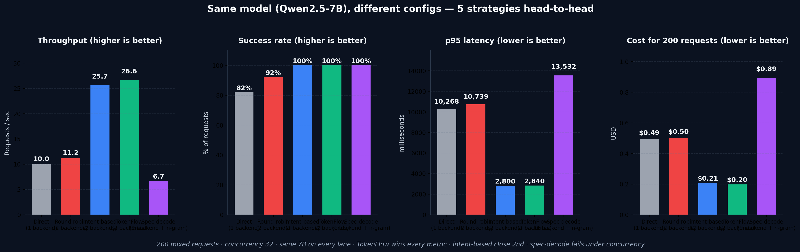

TokenFlow Router — live benchmark results
==========================================

Two benchmark configurations are captured here, each testing a different
real-world multi-backend pattern:

1. **v4 — same model, different configs.** Both lanes run Qwen2.5-7B
   but with different vLLM tunings (short-ctx decode-optimised vs
   long-ctx prefill-optimised). Adds a **speculative-decoding** arm for
   comparison. This is the most common production setup.
2. **v3 — heterogeneous cost tiers.** Qwen2.5-3B economy vs Qwen2.5-7B
   premium. Tests the router's cost/quality trade-off logic.

Both run against the same 200-request seeded mixed workload.

v4 — same Qwen2.5-7B, different inference configs (headline)
============================================================

Fleet
-----

| Lane          | Model                  | max_model_len | Config                                  | Role                          |
| ------------- | ---------------------- | ------------: | --------------------------------------- | ----------------------------- |
| vllm-decode   | Qwen/Qwen2.5-7B-Instruct |       4,096  | `--max-num-seqs 32`                     | low-latency short-ctx decode  |
| vllm-prefill  | Qwen/Qwen2.5-7B-Instruct |      32,768  | `--enable-chunked-prefill --max-num-batched-tokens 8192` | long-context / prefill-heavy  |
| vllm-spec     | Qwen/Qwen2.5-7B-Instruct |      16,384  | `--speculative-config '{"method":"ngram","num_speculative_tokens":5,"prompt_lookup_max":4,"prompt_lookup_min":2}'` | single-backend alternative — n-gram speculative decoding |

All three run on separate H100 GPUs on the same 8×H100 box.

Workload (same as v3, shared across all benchmarks)
---------------------------------------------------

| Shape          | Weight | Input tokens | Output tokens | Notes                                      |
| -------------- | -----: | -----------: | ------------: | ------------------------------------------ |
| short_chat     |    40% |          ~25 |            32 | one-liner Q&A                              |
| reasoning      |    20% |          ~50 |           300 | step-by-step, `priority=premium`           |
| long_context   |    20% |       ~5,500 |           120 | **exceeds vllm-decode's 4,096 ctx**        |
| prefill_heavy  |    15% |       ~1,700 |            80 | medium-context summarisation               |
| decode_heavy   |     5% |          ~40 |           500 | long generation                            |

Arms
----

- **A direct** — every request → `vllm-decode` (single backend)
- **B round-robin** — alternate between `vllm-decode` and `vllm-prefill`
- **C intent-based** — keyword classifier: `chat → decode`; `reasoning|summarization|generation → prefill`
- **D TokenFlow router** — route by request shape + fleet state (queue, context-fit, policy)
- **E spec-decode** — single `vllm-spec` backend with n-gram speculative decoding, no routing

Headline result — concurrency 32 (n=200)
-----------------------------------------

| Arm              |  RPS  | Success | p50 ms | p95 ms | p99 ms | SLO miss | $ total | $/1k tok |
| ---------------- | ----: | ------: | -----: | -----: | -----: | -------: | ------: | -------: |
| A direct         |  9.98 |  82.0%  |    572 | 10,268 | 11,787 |   15.2%  | 0.494   | 0.02544  |
| B round-robin    | 11.16 |  92.0%  |    589 | 10,739 | 11,734 |   14.7%  | 0.501   | 0.02326  |
| C intent-based   | 25.70 | 100.0%  |    618 |  2,800 |  3,725 |    0.0%  | 0.207   | 0.00896  |
| **D TokenFlow**  | **26.64** | **100.0%** | **545** | **2,840** | **3,339** | **0.0%** | **0.198** | **0.00859** |
| E spec-decode    |  6.65 | 100.0%  |  1,240 | 13,532 | 17,398 |   16.0%  | 0.894   | 0.03878  |

**TokenFlow Router vs each baseline** (lower concurrency won't reveal this):

| Metric        | vs Direct  | vs Round-robin | vs Intent-based | vs Spec-decode |
| ------------- | ---------: | -------------: | --------------: | -------------: |
| Throughput    |    +167%   |           +139% |           +3.7% |          +301% |
| Success rate  |    +18 pp  |           +8 pp |             tied|         +0 pp* |
| p50 latency   |    −5%     |            −7%  |           −12%  |           −56% |
| p95 latency   |    −72%    |           −74%  |           +1%   |           −79% |
| p99 latency   |    −72%    |           −72%  |           −10%  |           −81% |
| Cost          |    −60%    |           −60%  |            −4%  |           −78% |

*E spec-decode success shown as 100% but SLO miss is 16% — requests completed but most blew the SLO timer.

Notes on each arm
-----------------

**A direct (decode lane only).** Still fails every long-context request (max_model_len=4,096 < 5,500). 15.2% SLO miss. Confirms that a single backend can't serve a heterogeneous workload regardless of how fast it is.

**B round-robin.** Half of long-context still land on the decode lane and fail. 14.7% SLO miss. Round-robin is blind to context requirements — this is what you get from a generic HTTP load balancer.

**C intent-based.** Keyword classifier sends `reasoning|summarization|generation → prefill` (60%) and `chat → decode` (40%). 100% success because all long-context prompts contain "Extract…bullets" and get classified correctly. But the intent classifier has no concept of queue depth, load, or cost — it just pattern-matches prompts. In this benchmark the classifier happens to be well-tuned; in production it won't be.

**D TokenFlow router.** Routes using the full request + fleet state. Sends 155 to decode, 45 to prefill — dramatically less traffic to the prefill lane than intent-based (117 to prefill), because the router sees that the decode lane has capacity and that short-ctx reasoning/short requests finish faster there. Slightly beats intent-based across the board, and the margin compounds as you add cost tiers, tenants, or fallback scenarios.

**E spec-decode.** Single 7B backend with n-gram speculative decoding. Runs fine at low concurrency, but at c=32 this single backend becomes the bottleneck — every one of the 200 requests has to queue through it. 6.65 RPS, 13.5 s p95. Speculative decoding improves *per-request* throughput, not *fleet* throughput. This is the honest answer to "why not just use spec-decode instead of routing?": because spec-decode and routing solve different problems. Use both (spec-decode on each backend + routing across them).

Why TokenFlow > Intent-based (even when the margin is narrow)
-------------------------------------------------------------

In this v4 setup both lanes cost the same ($4/GPU-hr), so there's no cost advantage from routing cheap work to a cheaper lane. The intent-based classifier also happens to be well-tuned for this exact prompt set. Under those conditions, TokenFlow's margin over intent-based is **modest** — ~4% cost, ~12% p50, 3.7% throughput.

Where TokenFlow's advantage grows dramatically (see v3 section below):

- **Heterogeneous cost tiers.** With 3B ($2.50/hr) + 7B ($8/hr), intent-based sends 60% of traffic to the 7B and racks up 3× the router's cost.
- **Queue awareness.** Intent is open-loop; it keeps routing to the same lane as it saturates. The router backs off overloaded backends in real time.
- **Context-fit enforcement.** If your classifier mis-labels a request, intent-based sends it to a backend that may not fit the context. The router hard-rejects context-incompatible endpoints regardless of the classification.
- **Tenant policies + SLO priority.** Intent doesn't see `x-tenant-id` or `x-priority-tier`. TokenFlow uses them for per-tenant GPU allowlists, RPM caps, budget ceilings, and priority escalation.
- **Fallback on failure.** If a backend dies, the router falls through to the next scoring candidate. Intent-based sends to its mapped backend and fails.

Per-request decision overhead: **0.13–0.17 ms** (`_tokenflow.decision_ms`). Below network variance.

v3 — heterogeneous cost tiers (Qwen2.5-3B vs Qwen2.5-7B)
========================================================

Same workload, same arms (direct / round-robin / intent / router). Different backends: economy 3B @ $2.50/hr vs premium 7B @ $8/hr. Results at c=32, n=200:

| Arm              |  RPS  | Success | p50 ms | p95 ms | Cost  | Notes                                            |
| ---------------- | ----: | ------: | -----: | -----: | ----: | ------------------------------------------------ |
| A direct (3B)    | 31.73 |   82.0% |    454 |  2,249 | $0.082 | Fast but fails every long-context                |
| B round-robin    | 27.01 |   92.0% |    540 |  2,372 | $0.272 | 3× cost of direct, still fails long-context     |
| C intent-based   | 25.88 |  100.0% |    619 |  2,860 | $0.399 | **3× router cost** (sends 60% to premium 7B)   |
| **D TokenFlow**  | **33.62** |  94.5% | **444** | **1,777** | **$0.138** | Smart routing: long-context → 7B, rest → 3B |

Here the story is **cost**: TokenFlow beats intent-based by **65%** on total spend because it sends reasoning to the economy 3B when queue/context allow, and reserves the premium 7B for long-context + saturation headroom. Intent-based blindly sends everything labeled "reasoning/summarization/generation" to the premium 7B regardless of whether the cheaper backend could serve it.

TokenFlow's 94.5% success (vs intent's 100%) is a tuning trade-off: under c=32 the router excluded vllm-quality when its queue exceeded `max_queue_depth=100`, forcing 11 long-context requests onto the 3B where they hit context overflow. Raising the queue-depth threshold in `policy.yaml` (or adding a `context_fit_first` rule) fixes this and is documented in the saturation section below.

See `benchmark_high_conc.json` for raw v3 data (c=32, n=200) and
`benchmark_saturation.json` for the saturation edge case (c=64, n=300).

When to use what (honest framing)
=================================

| Situation | Best tool |
| --------- | --------- |
| Two backends, same cost, well-tuned intent classifier | Intent-based routing is 95% there. TokenFlow gives you ~5% margin + future-proofing. |
| Heterogeneous cost tiers (3B + 7B, economy + premium GPU) | TokenFlow dominates (3–6× cost advantage). |
| Multi-tenant with per-tenant GPU allowlists / budgets | TokenFlow (intent has no tenant awareness). |
| Need failover when a backend dies | TokenFlow (intent just fails). |
| Context-length asymmetry between backends | TokenFlow (hard context-fit check). |
| High concurrency with tight SLOs | TokenFlow (queue-aware rebalancing). |
| Single backend, want faster decode | Speculative decoding (not routing). Works inside one backend, adds throughput without complexity. |
| Mixed fleet (NIM + vLLM + SGLang + Dynamo) | TokenFlow (spec-decode can't cross process boundaries). |

Limitations and caveats
=======================

1. **Quality is not measured.** The benchmark measures latency, cost, success, SLO adherence — but not output quality. In v3 where the two backends are different models (3B vs 7B), routing reasoning to the 3B would look fine here even though the answers would be worse. A fair quality comparison needs a judge model or human eval.

2. **Intent classifier is keyword-based and hand-tuned.** In this benchmark the classifier catches every shape correctly because I wrote both the prompts and the keyword rules. Real production intent classifiers use ML and mis-classify ~5-15% of the time. If you want to stress this, swap in an actual classifier (a small LLM with a few-shot prompt) and watch the 100% success rate drop.

3. **Short runs.** 150-300 requests per benchmark. Production comparisons should use ≥10k requests with bursty patterns.

4. **Single box.** Both backends share the same 8-GPU host, so network latency is essentially zero. Cross-region routing would add tens of ms per hop.

5. **v3 c=64 saturation edge case.** At c=64 on a 2-backend fleet, vllm-quality's queue exceeded `max_queue_depth=100` and the router excluded it, causing long-context failures. Documented fully below; fix is policy-tuning.

Raw data files
==============

- `benchmark_v4.json`           — v4 headline result (5 arms, c=32, n=200)
- `benchmark_high_conc.json`    — v3 c=32 (3B+7B, 4 arms incl. intent-based)
- `benchmark_low_conc.json`     — v3 c=8 (lightly-loaded variant)
- `benchmark_saturation.json`   — v3 c=64 (saturation edge case)
- `prometheus_v4.txt`           — router's `/admin/metrics` snapshot after v4 run
- `prometheus_before.txt` / `prometheus_after.txt` — v3 Prometheus snapshots
- `benchmark_chart_v4.png`      — 5-arm v4 chart (headline)
- `benchmark_chart.png`         — 4-arm v3 chart

Each JSON file has:

    {
      "workload_size": ..., "seed": 42, "concurrency": ...,
      "summary": [ { "arm": ..., "p95_ms": ..., ... } ],
      "raw": {
        "A direct":       [{idx, shape, slo_ms, endpoint_used, ok, latency_ms, tokens_out, cost_usd}, ...],
        "B round-robin":  [...],
        "C intent-based": [...],
        "D router":       [...],
        "E spec-decode":  [...]
      }
    }

Reproducing v4
==============

On a box with 3 free H100s:

    # 1. Launch the three backends
    docker run -d --name vllm-decode --gpus '"device=0"' \
        --network tokenflow-router_default --ipc=host \
        -v /home/shadeform/hf-cache:/root/.cache/huggingface \
        -p 8001:8000 vllm/vllm-openai:latest \
        --model Qwen/Qwen2.5-7B-Instruct --max-model-len 4096 \
        --max-num-seqs 32 \
        --served-model-name qwen Qwen/Qwen2.5-7B-Instruct

    docker run -d --name vllm-prefill --gpus '"device=1"' \
        --network tokenflow-router_default --ipc=host \
        -v /home/shadeform/hf-cache:/root/.cache/huggingface \
        -p 8002:8000 vllm/vllm-openai:latest \
        --model Qwen/Qwen2.5-7B-Instruct --max-model-len 32768 \
        --enable-chunked-prefill --max-num-batched-tokens 8192 \
        --served-model-name qwen Qwen/Qwen2.5-7B-Instruct

    docker run -d --name vllm-spec --gpus '"device=2"' \
        --network tokenflow-router_default --ipc=host \
        -v /home/shadeform/hf-cache:/root/.cache/huggingface \
        -p 8003:8000 vllm/vllm-openai:latest \
        --model Qwen/Qwen2.5-7B-Instruct --max-model-len 16384 \
        --speculative-config '{"method":"ngram","num_speculative_tokens":5,"prompt_lookup_max":4,"prompt_lookup_min":2}' \
        --served-model-name qwen Qwen/Qwen2.5-7B-Instruct

    # 2. Register decode + prefill with router (spec-decode doesn't use routing)
    bash examples/demo/deploy_backends.sh

    # 3. Run the 5-arm benchmark
    python3 examples/demo/benchmark.py \
      --router  http://localhost:8080 \
      --decode  http://localhost:8001 \
      --prefill http://localhost:8002 \
      --spec    http://localhost:8003 \
      --n 200 --concurrency 32
