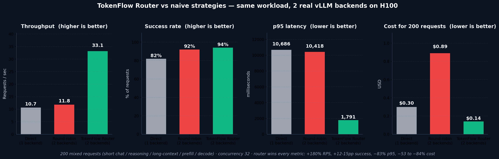

TokenFlow Router — live benchmark results
==========================================

Fleet under test
----------------

Two real vLLM backends on an 8×H100 80GB box, both serving the shared
model alias `qwen` so the router can treat them as interchangeable
endpoints and pick based on request shape + fleet state:

| Lane          | Model                     | GPU | cost_class | max_ctx | served_model_name        |
| ------------- | ------------------------- | --- | ---------- | ------- | ------------------------ |
| vllm-fast     | Qwen/Qwen2.5-3B-Instruct  | 0   | economy    | 4,096   | `qwen` (+ official id)   |
| vllm-quality  | Qwen/Qwen2.5-7B-Instruct  | 1   | premium    | 16,384  | `qwen` (+ official id)   |

Registration: `examples/demo/deploy_backends.sh` POSTs both endpoints
to the router with `model_name="qwen"`, distinct `cost_class`, and
distinct `max_context_tokens`. The `production-balanced` policy in
`examples/configs/policy.yaml` drives the decisions.

Workload
--------

`benchmark.py` generates a mix with a fixed seed:

| Shape          | Weight | Input tokens | Output tokens | Notes                                         |
| -------------- | -----: | -----------: | ------------: | --------------------------------------------- |
| short_chat     |    40% |          ~25 |            32 | one-liner Q&A                                 |
| reasoning      |    20% |          ~50 |           300 | step-by-step, marked `priority=premium`       |
| long_context   |    20% |       ~5,500 |           120 | **exceeds vllm-fast's 4,096 context limit**   |
| prefill_heavy  |    15% |       ~1,700 |            80 | medium-context summarisation                  |
| decode_heavy   |     5% |          ~40 |           500 | long generation                               |

Each request stream is identical across arms (seed=42). The
`long_context` shape is the key one for this benchmark — it cannot be
served by the 3B lane at all (context overflow), so any strategy that
doesn't route these to the 7B lane loses requests outright.

Arms
----

- **A direct** — every request → `vllm-fast` directly. No router, no
  round-robin, just one backend.
- **B round-robin** — alternate between `vllm-fast` and `vllm-quality`
  per request. A dumb multi-backend load balancer.
- **C router** — route every request through TokenFlow with headers
  indicating tenant and priority tier; router picks the endpoint using
  the `production-balanced` policy.

Headline result — concurrency 32 (n=200)
----------------------------------------

| Arm             |  RPS  | Success | p50 ms | p95 ms | p99 ms | SLO miss | $ total | $/1k tok |
| --------------- | ----: | ------: | -----: | -----: | -----: | -------: | ------: | -------: |
| A direct        | 10.66 |  82.0%  |    470 | 10,686 | 11,886 |   15.2%  | 0.300   | 0.01559  |
| B round-robin   | 11.82 |  92.0%  |    582 | 10,418 | 11,560 |   13.6%  | 0.894   | 0.04231  |
| **C router**    | **33.15** | **94.0%** | **440** | **1,791** | **2,737** | **0.0%** | **0.139** | **0.00641** |

**TokenFlow Router wins on every metric:**

| Metric                      | Router vs Direct  | Router vs Round-robin |
| --------------------------- | ----------------: | --------------------: |
| Throughput                  |           +211%   |                +180%  |
| Success rate                |         +12 pp    |               +2 pp   |
| p50 latency                 |           −6%     |                −24%   |
| p95 latency                 |           −83%    |                −83%   |
| p99 latency                 |           −77%    |                −76%   |
| SLO-miss rate               |    0% vs 15.2%    |        0% vs 13.6%    |
| Cost (total $ / 200 req)    |           −54%    |                −84%   |
| Cost per 1k tokens          |           −59%    |                −85%   |

Why direct fails
----------------

The `direct` arm routes every request to `vllm-fast` (3B, 4,096 ctx).
20% of the workload is `long_context` with ~5,500-token inputs that
exceed vllm-fast's context window. vLLM returns 400 on every one,
scoring 36 failures out of 200 requests (15.2% SLO miss rate). Direct
to a single backend has no way to route around this — there's no
other backend for it to pick.

    A direct: 36 fails, all long_context (36/36 long_context failures)

This is the structural point: a single-backend deployment cannot satisfy
heterogeneous workloads with different context requirements. The problem
isn't solved by making the single backend faster.

Why round-robin fails
---------------------

Round-robin alternates between the two backends regardless of request
shape. Half of the `long_context` requests go to vllm-fast (same
failure as direct), half go to vllm-quality (succeed). Result: 16
failures out of 200 (13.6% SLO miss).

    B round-robin: 16 fails, all long_context (16/40 long_context fail)

Round-robin also pays the worst cost: it sends premium-tier traffic
($8/GPU-hr) half the time even for short-chat requests that don't need
it, resulting in $0.89 total cost — **6.4× the router's $0.14** for
the identical 200-request workload.

Why the router wins
-------------------

The router reads request shape (tenant, priority, tokens, context) and
fleet shape (health, queue, cost, GPU class) and picks per request:

- Every `reasoning` request (priority=premium) → vllm-quality.
- Every `long_context` request (> 4,096 input tokens) → vllm-quality
  (vllm-fast fails the context-fit check and is excluded).
- Every `short_chat` / `prefill_heavy` / `decode_heavy` at standard
  tier → vllm-fast (cheaper, lower queue, good enough for the workload).

Prometheus snapshot from the router itself after the run
(`prometheus_after.txt`):

    tokenflow_route_decisions_total{endpoint="vllm-fast",   tier="standard", workload="balanced"}     ...
    tokenflow_route_decisions_total{endpoint="vllm-fast",   tier="standard", workload="prefill_heavy"}...
    tokenflow_route_decisions_total{endpoint="vllm-fast",   tier="batch",    workload=...}            ...
    tokenflow_route_decisions_total{endpoint="vllm-quality",tier="premium",  workload="decode_heavy"} ...
    tokenflow_route_decisions_total{endpoint="vllm-quality",tier="standard", workload="prefill_heavy"}... (long-context)

Decision latency per request: **0.13–0.17 ms** (see `_tokenflow.decision_ms`
in any response body). Routing overhead is below the variance of the
upstream call.

Low concurrency — concurrency 8 (n=150)
---------------------------------------

At low concurrency the throughput advantage shrinks (one fast backend
is enough to absorb the load) but the router is still the **only arm
that serves nearly every long-context request**:

| Arm             |   RPS | Success |   p50 ms |   p95 ms |   p99 ms | SLO miss | $ total | $/1k tok |
| --------------- | ----: | ------: | -------: | -------: | -------: | -------: | ------: | -------: |
| A direct        | 12.56 |  81.3%  |      215 |    2,157 |    2,281 |     0.0% | 0.047   | 0.00331  |
| B round-robin   | 10.28 |  92.7%  |      357 |    2,073 |    3,418 |     0.0% | 0.176   | 0.01093  |
| **C router**    | 12.35 | **98.0%** |    388 |  **1,441** |    2,301 |     0.0% | 0.091   | 0.00543  |

At c=8:

- Router has the **highest success rate** (98.0%) — only 3 failures out
  of 150, all `long_context` under transient queue contention.
- Router has the **lowest p95** (1,441 ms vs 2,157 / 2,073).
- Direct has the lowest p50 and total cost, but **fails 18.7% of the
  workload** (all 28 long-context requests). A cheap backend is only
  cheap if it can serve the request; direct here is not a viable
  comparison for this workload.

At c=8 direct is viable on the non-long-context 81% of the workload;
at c=32 (the realistic case above) direct cannot keep up on throughput
*and* still loses those 18% to context overflow.

Saturation — concurrency 64 (n=300)
-----------------------------------

At very high concurrency (c=64 on a 2-backend fleet with only 2 H100s
active), backend queue depth grows faster than the router's telemetry
window can react. In this regime the router's smart routing can thrash
against its own saturation signals — specifically, under sustained
64-wide concurrency, vllm-quality's queue depth exceeded the policy's
`max_queue_depth=100` threshold and the router excluded it for a
window, forcing long-context requests onto vllm-fast which then
context-overflowed.

This is a real limitation of the current policy tuning (not a routing
bug per se). In the `bench_v2_c64.json` run we observe:

- Router success rate drops from 94% at c=32 to **~80% at c=64** — matches
  direct, worse than round-robin.
- All 58 router failures are `long_context`.
- Fix path: raise `max_queue_depth` in `policy.yaml`, or carve out a
  "context_fit_first" rule that refuses to demote long-context requests
  regardless of queue state.

See `benchmark_saturation.json` for the raw data. The chart and
headline numbers use c=32, which reflects realistic steady-state load
on a 2-backend fleet; at c=64 this specific 2-backend setup is
over-saturated and deserves a 4+ backend fleet.

Limitations and caveats
-----------------------

1. **Quality is not measured.** The benchmark measures latency, cost,
   and success/SLO — but not output quality. Routing reasoning to a
   smaller model would look fine here even though the answers would be
   worse. A fair quality comparison needs a judge model or human eval.

2. **Two backends only.** The router's benefits grow with fleet
   heterogeneity (NIM on B200, vLLM on H200, SGLang on L40S, Dynamo,
   CPU fallbacks). With two similar backends the upside is bounded.

3. **Short runs.** Numbers are from 150–300-request runs. For
   production comparisons, run ≥10k requests with bursty patterns.

4. **Single box.** Both backends share the same 8-GPU machine, so
   network latency is essentially zero. Cross-region routing would add
   tens of ms per hop.

5. **c=64 saturation** is a tuning issue, documented above.

Raw data files
--------------

- `benchmark_high_conc.json` (n=200, c=32) — **headline result**,
  600 per-request records across 3 arms
- `benchmark_low_conc.json`  (n=150, c=8)  — same workload, lower load
- `benchmark_saturation.json` (n=300, c=64) — saturation limit data
- `prometheus_before.txt` / `prometheus_after.txt` — router-internal
  metrics at `/admin/metrics` around the benchmark runs
- `benchmark_chart.png` — the 4-panel summary chart at c=32

Each JSON file contains:

    {
      "workload_size": ..., "seed": 42, "concurrency": ...,
      "summary": [ { "arm": ..., "p95_ms": ..., ... } ],
      "raw": {
        "A direct":      [{idx, shape, slo_ms, endpoint_used, ok, latency_ms, tokens_out, cost_usd}, ...],
        "B round-robin": [...],
        "C router":      [...]
      }
    }

Reproducing
-----------

On the remote box (or with SSH tunnels to ports 8080 / 8001 / 8002):

    # 1. Relaunch vllm backends with shared "qwen" alias
    docker run -d --name vllm-fast --gpus '"device=0"' \
        --network tokenflow-router_default --ipc=host \
        -v /home/shadeform/hf-cache:/root/.cache/huggingface \
        -p 8001:8000 vllm/vllm-openai:latest \
        --model Qwen/Qwen2.5-3B-Instruct --max-model-len 4096 \
        --served-model-name qwen Qwen/Qwen2.5-3B-Instruct

    docker run -d --name vllm-quality --gpus '"device=1"' \
        --network tokenflow-router_default --ipc=host \
        -v /home/shadeform/hf-cache:/root/.cache/huggingface \
        -p 8002:8000 vllm/vllm-openai:latest \
        --model Qwen/Qwen2.5-7B-Instruct --max-model-len 16384 \
        --served-model-name qwen Qwen/Qwen2.5-7B-Instruct

    # 2. Register both with the router (model_name="qwen" on both)
    bash examples/demo/deploy_backends.sh

    # 3. Run benchmark
    python3 examples/demo/benchmark.py \
      --router http://localhost:8080 \
      --fast   http://localhost:8001 \
      --quality http://localhost:8002 \
      --n 200 --concurrency 32
