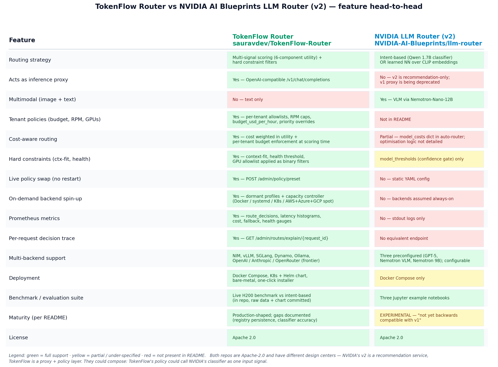

TokenFlow Router vs NVIDIA AI Blueprints LLM Router (v2)
=========================================================

[NVIDIA-AI-Blueprints/llm-router](https://github.com/NVIDIA-AI-Blueprints/llm-router)
is the closest first-party comparable in the space, so it's worth being
explicit about how the two projects relate.

> **TL;DR:** different design centers, not direct competitors.
> NVIDIA's v2 is a **classifier-as-a-service** (returns model
> recommendations to a caller). TokenFlow is a **proxy + policy**
> layer that actually forwards inference and enforces tenant rules.
> They could compose — TokenFlow's scoring engine could call the
> NVIDIA classifier as one input signal.



Side-by-side feature table
--------------------------

| Feature | TokenFlow Router | NVIDIA LLM Router (v2, experimental) |
|---|---|---|
| Routing strategy | Multi-signal scoring (6-component utility) + hard constraint filters | Intent-based via Qwen 1.7B classifier OR learned NN over CLIP embeddings |
| Acts as inference proxy | **Yes** — OpenAI-compatible `/v1/chat/completions` | **No** — v2 is recommendation-only; v1 proxy is being deprecated |
| Multimodal (image + text) | No — text only | **Yes** — VLM via Nemotron-Nano-12B |
| Tenant policies (budget, RPM, GPU allowlist) | **Yes** — per-tenant configs read from `x-tenant-id` at scoring time | Not in README |
| Cost-aware routing | **Yes** — cost weighted in utility + per-tenant `budget_usd_per_hour` enforced | Partial — `model_costs` dict exists; optimisation logic not detailed |
| Hard constraints (context-fit, health) | **Yes** — context-fit, health threshold, GPU allowlist as binary filters | `model_thresholds` confidence gate only |
| Live policy swap (no restart) | **Yes** — `POST /admin/policy/preset` | No — static YAML config |
| On-demand backend spin-up | **Yes** — dormant profiles + capacity controller (Docker / systemd / K8s / AWS+Azure+GCP spot) | No — backends assumed always-on |
| Prometheus metrics | **Yes** — route_decisions, latency histograms, cost, fallback, health gauges | No — stdout logs only |
| Per-request decision trace | **Yes** — `GET /admin/routes/explain/{request_id}` | No equivalent endpoint |
| Multi-backend support | NIM, vLLM, SGLang, Dynamo, Ollama, OpenAI/Anthropic/OpenRouter (frontier) | Three preconfigured (GPT-5, Nemotron-Nano-12B-VL, Nemotron-Nano-9B); configurable |
| Deployment | Docker Compose, Kubernetes (Helm chart), bare-metal, one-click installer | Docker Compose only |
| Benchmark / evaluation | Live H200 benchmark vs intent-based, raw data + chart committed to repo | Three Jupyter example notebooks |
| Maturity (per README) | Production-shaped; documented gaps (registry persistence, classifier accuracy) | "EXPERIMENTAL — not yet backwards compatible with v1" |
| License | Apache 2.0 | Apache 2.0 |

Where each one is the right pick
--------------------------------

**Choose NVIDIA LLM Router v2 when:**
- You need **multimodal routing** (text + image) — TokenFlow doesn't do that today
- You want a learned classifier (CLIP+NN) trained on your traffic and don't want to hand-author scoring weights
- Your traffic is single-tenant or tenancy is enforced at a different layer
- You want first-party NVIDIA support and a recommendation engine you can plug into your own proxy
- You're starting from scratch and want a quick "intent → model" mapping for a small model zoo

**Choose TokenFlow Router when:**
- You need to **actually proxy** inference traffic (most production setups)
- You have **multiple tenants** with distinct budgets, RPM caps, GPU allowlists
- Your fleet has **heterogeneous cost tiers** (3B economy + 7B premium + frontier API) and you need cost weighted in the routing decision
- You want **live policy swaps** without redeploys (peak-hour cost-first, off-peak latency-first, etc.)
- You have spiky workloads where some backends should be **dormant most of the time** (capacity controller spins them up on demand)
- You need **per-request decision traces** for debugging or audit (`/admin/routes/explain/{id}`)
- You need **Kubernetes deployment** with Helm + IRSA / AKS-workload-identity slots
- You want **observability** — Prometheus, structured JSON logs, decision histograms

How they could compose
----------------------

These are not mutually exclusive. A reasonable production architecture
runs **both**:

```
                      ┌─────────────────────────────────────┐
client → TokenFlow ──▶│ scoring engine                      │
                      │   queue depth │ cost │ tenant policy │ ◀── live signals
                      │   ⤷ classifier signal (NVIDIA v2)   │ ◀── HTTP call to
                      │     "this prompt looks like X"      │     NVIDIA classifier
                      └─────────────┬───────────────────────┘
                                    ▼
                              backend pool
                              (NIM / vLLM / SGLang / OpenAI / …)
```

NVIDIA's v2 returns "this prompt looks like a hard reasoning task" or
"this prompt has an image attached." TokenFlow takes that as one input
to its multi-signal score, then layers tenant policy + cost + queue
state + context-fit on top, and forwards the request to the chosen
backend with `Authorization: Bearer …` injected for frontier APIs.

The classifier becomes the *workload-type signal*; TokenFlow becomes
the *enforcement layer*. Each does what it's good at.

What's missing in this comparison
---------------------------------

- **Quality / accuracy of the routing classifier** isn't measured in
  TokenFlow's benchmark — it's a deliberate scope decision (latency,
  cost, success/SLO are the metrics). NVIDIA's CLIP+NN approach almost
  certainly produces a more accurate intent label than a keyword
  classifier. If you only care about "did the right model get the
  prompt," NVIDIA's classifier will likely beat any keyword-based
  intent router (including the keyword classifier baseline in
  TokenFlow's benchmark).
- **Multimodal traffic** isn't in TokenFlow's scope today. If your
  workload includes image inputs or VLM responses, TokenFlow won't
  help on the input-classification side. It can still proxy the
  inference call to a VLM backend, but it doesn't decide which VLM
  based on the image content.
- **NVIDIA's v1 (Rust proxy + BERT)** would be a more direct apples-
  to-apples comparison to TokenFlow as a proxy, but it's being
  deprecated in favour of v2's recommendation-only model.
