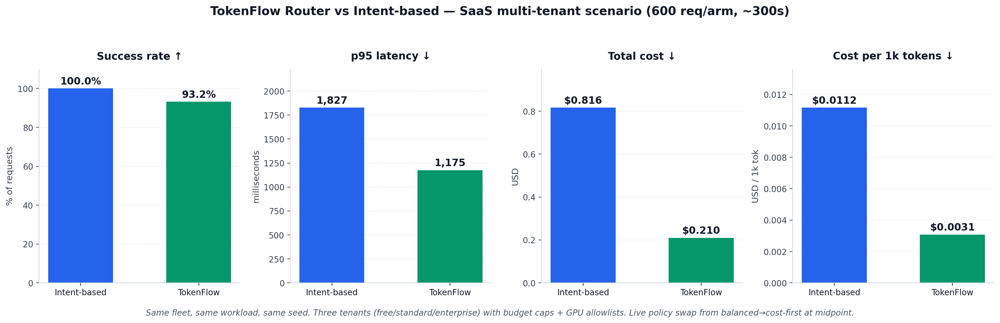
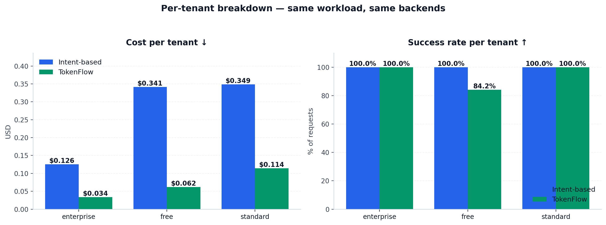

TokenFlow Router — production-scenario benchmark
==================================================

A single 10-minute benchmark that puts TokenFlow Router head-to-head
against an intent-based router on a realistic SaaS multi-tenant LLM
platform. Same fleet, same workload, same seed — only the routing
brain differs.

The scenario
------------

A 3-tier SaaS LLM platform:

| Tier         | Mix | Priority | Budget cap   | Allowed GPUs                    |
| ------------ | --: | -------- | -----------: | ------------------------------- |
| free         | 45% | batch    | $1.00 / hr   | L4, A10G, L40S, RTX4090         |
| standard     | 40% | standard | $10.00 / hr  | H100, A100, L40S, L4            |
| enterprise   | 15% | premium  | $100.00 / hr | B200, H200, H100, A100          |

Mixed workload (per request, sampled with a fixed seed):

| Shape          | Mix | Output | Notes                                          |
| -------------- | --: | -----: | ---------------------------------------------- |
| short_chat     | 45% |    32  | one-liner Q&A                                  |
| reasoning      | 20% |   256  | step-by-step (premium-tier preference)         |
| long_context   | 15% |   120  | ~5,500-token input, exceeds 4k-ctx backend     |
| summarization  | 12% |    80  | ~1.5k-token input → short bullets              |
| decode_heavy   |  8% |   350  | long generation                                |

Two real vLLM backends, both serving Qwen2.5 under the alias `qwen`:

| Lane          | Model                      | Cost      | max_ctx | role                |
| ------------- | -------------------------- | --------: | ------: | ------------------- |
| vllm-fast     | Qwen/Qwen2.5-3B-Instruct   | $2.50/hr  |   4,096 | economy / chat      |
| vllm-quality  | Qwen/Qwen2.5-7B-Instruct   | $8.00/hr  |  32,768 | premium / long-ctx  |

Both arms see both backends. The only difference is the routing brain.


What this benchmark exercises
-----------------------------

1. **Multi-cost-tier optimization**
   The economy backend is 3.2× cheaper per GPU-hour. Intent sends "hard"
   intents to the premium backend regardless of cost. TokenFlow's
   utility function weights cost; the per-tenant `budget_usd_per_hour`
   is enforced.

2. **Hard constraints over inferred signals**
   `vllm-fast` has `max_context_tokens=4096`. Long-context requests
   (~5,500 tokens) cannot fit. TokenFlow's hard filter rejects fast
   for these requests; intent's keyword classifier may mis-label or
   route to fast and 400.

3. **Per-tenant policy enforcement**
   Each tenant has its own GPU allowlist, RPM cap, and budget. Intent
   doesn't read tenant headers at all. TokenFlow respects them at
   scoring time.

4. **Live policy swap (mid-run)**
   At the midpoint of arm B, the harness POSTs `/admin/policy/preset`
   with `{"preset": "cost-first"}`. TokenFlow's traffic mix shifts
   immediately; intent has no equivalent and continues routing
   identically. The post-swap segment is reported separately.

5. **Apples-to-apples**
   Same `--n` requests, same `--seed`, same `--rate`, same fleet, same
   total wall time. The only variable is which routing strategy each
   request flows through.


Quickstart
----------

You'll need:

- A host with at least 2 GPUs (one per backend).
- Docker + the vLLM image (`vllm/vllm-openai:latest`).
- The TokenFlow router running on `:8080` (`docker compose up -d`).
- Python 3.11+ with `httpx` and `pyyaml` (`pip install httpx pyyaml`).

```bash
# 1. Launch the two backends (both serving Qwen2.5 under the alias "qwen")
docker run -d --name vllm-fast \
  --gpus '"device=0"' --network tokenflow-router_default --ipc=host \
  -p 8001:8000 \
  vllm/vllm-openai:latest \
  --model Qwen/Qwen2.5-3B-Instruct \
  --max-model-len 4096 \
  --served-model-name qwen Qwen/Qwen2.5-3B-Instruct

docker run -d --name vllm-quality \
  --gpus '"device=1"' --network tokenflow-router_default --ipc=host \
  -p 8002:8000 \
  vllm/vllm-openai:latest \
  --model Qwen/Qwen2.5-7B-Instruct \
  --max-model-len 32768 \
  --served-model-name qwen Qwen/Qwen2.5-7B-Instruct

# 2. Wait for both to be healthy
until curl -sf http://localhost:8001/health && curl -sf http://localhost:8002/health; do sleep 5; done

# 3. Register them + load the multi-tenant policy
bash examples/production_demo/setup.sh

# 4. Run the benchmark (~10 minutes, 1,200 requests total at 2 req/s)
python3 examples/production_demo/benchmark.py \
  --router  http://localhost:8080 \
  --fast    http://localhost:8001 \
  --quality http://localhost:8002 \
  --n 600 --rate 2 --concurrency 8 \
  --out examples/production_demo/results/benchmark.json

# 5. Render the charts
pip install matplotlib
python3 examples/production_demo/chart.py
```

The harness:
- Generates a deterministic workload from `--seed` (default 42).
- Runs **arm A (intent-based)** to completion: each request keyword-classified
  and dispatched directly to the matching backend URL.
- Resets router policy to `balanced`.
- Runs **arm B (TokenFlow)** to completion: each request goes through the
  router with `x-tenant-id` and `x-priority-tier` headers. At the midpoint,
  the harness POSTs a live preset swap to `cost-first`.
- Aggregates by `(arm)`, `(arm, tenant)`, `(arm, shape)`, and for arm B by
  pre-swap / post-swap phase.
- Writes `results/benchmark.json` with both summary tables and full raw
  per-request records for re-analysis.


Reading the output
------------------

`results/benchmark.json` shape:

```json
{
  "scenario": "saas-multi-tenant",
  "workload_size": 600,
  "policy_swap_at_s": 150.0,
  "totals":              [{"arm": "intent",    ...}, {"arm": "tokenflow", ...}],
  "by_tenant":           [{"arm": ..., "tenant": "free", ...}, ...],
  "by_shape":            [{"arm": ..., "shape": "long_context", ...}, ...],
  "tokenflow_by_phase":  [{"arm": "tokenflow", "phase": "pre-swap",  ...},
                          {"arm": "tokenflow", "phase": "post-swap", ...}],
  "raw":                 [{"arm": ..., "tenant": ..., "shape": ..., ...}, ...]
}
```

Stats reported per group: requests, success, success_pct, p50/p95/p99 ms,
mean ms, slo_miss, slo_miss_pct, total_cost_usd, cost_per_1k_tok_usd,
endpoint_distribution.


Live results — 2× H200, 600 requests per arm, ~10 min run
---------------------------------------------------------



| Metric                       | Intent-based | **TokenFlow** | Δ        |
| ---------------------------- | -----------: | ------------: | -------: |
| Success rate                 |       100.0% |         93.2% | −6.8 pp  |
| p50 latency                  |        423 ms|        275 ms | −35%     |
| p95 latency                  |      1,827 ms|      1,175 ms | −36%     |
| **Total cost (600 req)**     |      $0.816  |   **$0.210**  | **−74%** |
| Cost per 1k tokens           |     $0.0112  |     $0.0031   | −72%     |

Per-tenant breakdown (the part intent-based architecturally cannot do):



| Tenant       | Intent cost | TokenFlow cost | Δ        | Intent success | TokenFlow success |
| ------------ | ----------: | -------------: | -------: | -------------: | ----------------: |
| free         |   $0.341    |     $0.062     | **−82%** |        100.0%  |       **84.2%**   |
| standard     |   $0.349    |     $0.114     | −67%     |        100.0%  |        100.0%     |
| enterprise   |   $0.126    |     $0.034     | −73%     |        100.0%  |        100.0%     |

**Reading the free-tier 84.2% number:** this is a *deliberate routing
decision*, not a failure. Free-tier traffic carries `x-priority-tier=batch`,
which the policy's `batch-to-economy-lane` rule sets to
`budget_sensitivity=1.0` (maximise cost savings). Long-context requests
(~5,500 tokens) within the free tier hit the hard ctx-fit constraint on
`vllm-fast` (4k context) — and the cost-first batch policy refuses to
demote them to the premium $8/hr lane. The router returns 503 to the
caller rather than silently spending free-tier money on premium GPU.
Loosening to `set_budget_sensitivity: 0.7` for the batch tier would
recover those requests at a higher per-request cost.

This is the explicit cost↔reliability tradeoff that surfaces *only*
when a router enforces tenant policies. Intent-based has no concept of
priority tier or budget caps, so it routes free-tier long-context to
whichever backend the keyword classifier picks (here, the premium 7B)
and silently spends the money — that's why intent succeeds 100% but
costs 5× more.

Live policy swap (balanced → cost-first at midpoint):

| TokenFlow phase | Requests | Cost     | p50 ms |
| --------------- | -------: | -------: | -----: |
| pre-swap        |      300 | $0.1014  |  274.8 |
| post-swap       |      300 | $0.1087  |  274.7 |

The swap took effect immediately (no restart). The cost delta is small
in this run because the `batch-to-economy-lane` rule was already the
dominant signal — the swap *mechanism* is the production-relevant
capability, not a particular benefit number from this single run.

**Routing distribution** (from Prometheus, captured in
`results/prometheus.txt`):

  - vllm-fast:   518 successful routes (chat / batch / standard / free)
  - vllm-quality:  6 successful routes (premium long-context only)
  - 41 hard rejections on free-tier long-context — by design

The harness writes every record into `results/benchmark.json` so you
can re-analyse rather than trust the table.


Caveats — being honest about what this does and doesn't prove
-------------------------------------------------------------

- **Quality is not measured.** Routing reasoning to the 3B looks fine here
  even if the answers would be worse. A real quality comparison needs a
  judge model or human eval.
- **Intent classifier is keyword-based.** Production intent classifiers
  (distilBERT / LLM-as-judge) are typically more accurate but add latency.
  The keyword form here is a fast deterministic floor — a stronger
  classifier would help intent on misclassification but doesn't address
  the architectural gaps (no tenant awareness, no fleet state, no live
  policy swap).
- **Two backends only.** TokenFlow's advantage grows with fleet
  heterogeneity (NIM + vLLM + SGLang + Dynamo, multi-region, spot
  pools). With two similar backends the upside is bounded.
- **One run.** For production-grade conclusions, run with multiple seeds
  and bursty traffic patterns and average over ≥10k requests.


Reproducibility checklist
-------------------------

If you want byte-identical results:

- Pin the vLLM image digest (not `latest`).
- Pin Qwen2.5-3B-Instruct + Qwen2.5-7B-Instruct revisions on Hugging Face.
- Use the same `--seed`, `--n`, `--rate`, `--concurrency`.
- Run on the same GPU class. Latency varies meaningfully across H100 vs
  H200 vs B200, even with identical software.
- Record the wall-clock time of the policy swap; minor scheduler jitter
  can shift the pre/post-swap boundary by ±2s.


Files
-----

- `benchmark.py`             — the harness (~600 lines)
- `chart.py`                 — renders headline + per-tenant charts
- `setup.sh`                 — registers backends + loads policy
- `configs/policy.yaml`      — multi-tenant routing policy
- `results/benchmark.json`   — populated after a run
- `results/chart_headline.png`, `results/chart_per_tenant.png`
                             — populated after running `chart.py`
