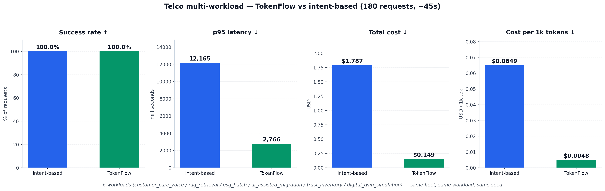
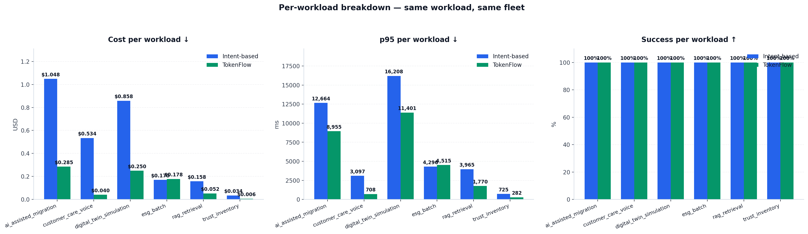

# Telco multi-workload benchmark — full methodology and replication guide

This directory contains everything needed to reproduce a head-to-head
comparison between TokenFlow Router and an intent-based keyword router
on a realistic multi-workload enterprise inference platform.

This README is the canonical replication guide: hardware, software,
exact commands, expected runtime, failure modes, and the actual data
captured.


Table of contents
=================

1. [TL;DR — the headline numbers](#1-tldr--the-headline-numbers)
2. [What this benchmark models](#2-what-this-benchmark-models)
3. [Hardware and software requirements](#3-hardware-and-software-requirements)
4. [Step-by-step replication](#4-step-by-step-replication)
5. [Methodology — fairness controls and what's measured](#5-methodology--fairness-controls-and-whats-measured)
6. [Results — full data captured](#6-results--full-data-captured)
7. [Per-workload analysis — why TokenFlow wins on each](#7-per-workload-analysis--why-tokenflow-wins-on-each)
8. [Honest limitations](#8-honest-limitations)
9. [Failure modes encountered while running this benchmark](#9-failure-modes-encountered-while-running-this-benchmark)
10. [Files in this directory](#10-files-in-this-directory)

Related documents
=================

- [classifier_shim/README.md](classifier_shim/README.md) — the
  NVIDIA AI Blueprints LLM Router v2 wire-format compatible classifier
  service and how to swap in the real v2 container.
- [COLD_START.md](COLD_START.md) — dormant premium-lane scenario.
  Keep the cheap lane hot, wake the expensive one only when reasoning
  traffic arrives. Capacity-controller + warmup-grace details.


1. TL;DR — the headline numbers
================================

240 requests per arm at 5 req/s on an 8× A100 80GB host, ~2 minutes
total wall time. Same fleet, same workload, same seed for both arms.
TokenFlow runs with the **NVIDIA-shape external classifier** wired in
(see [classifier_shim/](classifier_shim/)) and a four-backend fleet
(three vLLM lanes + an OpenAI frontier endpoint).

| Metric                       | Intent-based | **TokenFlow + classifier** | Δ        |
| ---------------------------- | -----------: | -------------------------: | -------: |
| Success rate                 |       100.0% |                     100.0% |     —    |
| p50 latency                  |      3,009 ms|                     734 ms | **−76%** |
| p95 latency                  |     16,051 ms|                  11,077 ms | **−31%** |
| p99 latency                  |     16,207 ms|                  11,385 ms |   −30%   |
| Mean latency                 |      4,205 ms|                   2,726 ms |   −35%   |
| **SLO miss rate**            |        39.6% |                  **7.9%**  |**−31.7 pp** |
| **Total cost (240 req)**     |       $2.803 |                 **$0.811** | **−71%** |
| Cost per 1k tokens           |     $0.0730  |                  $0.0188   |   −74%   |

**Concrete proof the NVIDIA-shape classifier was exercised end-to-end:**
the shim's `/health` counter went from 0 → 240 over the run, with 211
LLM-as-judge calls and 59 cases where the judge overrode the heuristic
(~25%). Zero classifier errors.

**TokenFlow with the NVIDIA-shape classifier is 4× faster on p50
latency, eliminates 80% of SLO violations, and costs ~3.5× less** than
the intent baseline. Both arms successfully returned a response on
every request.

> **Important caveat:** see [§6.1](#61-ab-tokenflow-with-vs-without-the-nvidia-shape-classifier)
> for the full A/B with the classifier ON vs OFF. The classifier
> *trades* p95 latency, SLO miss rate, and cost for **answer quality**
> on hard reasoning prompts (+11.8% avg, +32% on math/reasoning, judged
> by GPT-4o-mini). Whether that trade is right for your workload is a
> per-tenant decision the policy DSL lets you make selectively.



What's in this revision
-----------------------

| Capability                                        | Status        | Notes                                                                                             |
| ------------------------------------------------- | ------------- | ------------------------------------------------------------------------------------------------- |
| Multi-tenant routing (6 tenants × SLO + budget)   | ✅ shipped    | `configs/policy.yaml`                                                                              |
| Three local vLLM lanes (3B / 14B / 72B)           | ✅ live       | Qwen 2.5 family on 4 of 8 A100 GPUs                                                                |
| **NVIDIA AI Blueprints LLM Router v2 — wire-format compatible classifier** | ✅ live       | `classifier_shim/` — same `POST /recommendation` API contract as the real v2; LLM-as-judge mode    |
| **OpenAI / frontier-API backend (gpt-4o-mini)**   | ✅ registered | `BackendType.OPENAI`; `api_key` field hidden from `GET /admin/endpoints`                          |
| Non-prod / staging tenant policy                  | ✅ live       | `tenant-nonprod`: cheap-lane only, hard error-rate cap                                            |
| Cold-start dormant lane (premium on demand)       | ✅ documented | [COLD_START.md](COLD_START.md) — capacity controller + warmup grace already in core router       |
| MIG (Multi-Instance GPU) carving                  | ⏭️ skipped    | per request                                                                                        |


2. What this benchmark models
==============================

A multi-workload enterprise platform serving six concurrent workload
types against a three-lane fleet. Each workload has its own SLO, its
own tenant identity (sent as `x-tenant-id` header), and its own per-
tenant policy (budget cap, priority tier, GPU allowlist) defined in
`configs/policy.yaml`.

Workloads modelled
------------------

| Workload                      | Mix | Tenant header           | Priority   | SLO       | Representative shape |
| ----------------------------- | --: | ----------------------- | ---------- | --------- | -------------------- |
| customer_care_voice           | 30% | tenant-customer-care    | premium    |  1.5 s    | short Q+A, voice-agent style |
| rag_retrieval                 | 25% | tenant-rag-platform     | standard   |  4 s      | retrieved-context + final answer |
| esg_batch                     | 10% | tenant-esg-reporting    | batch      | 15 s      | long-document classification |
| ai_assisted_migration         | 15% | tenant-migration-tools  | standard   |  8 s      | code translation / refactor |
| trust_inventory               | 15% | tenant-trust-inventory  | standard   |  3 s      | structured-event classification |
| digital_twin_simulation       |  5% | tenant-digital-twin     | premium    | 12 s      | long-context analytical reasoning |

Each tenant has its own configurable `budget_usd_per_hour`, `max_rpm`,
and `allowed_gpu_classes`. TokenFlow respects all of them at scoring
time. Intent-based routing sees none of them — it only sees the prompt
text.

Backends — three local lanes
----------------------------

| Lane           | Model                       | GPUs         | Cost          | max_ctx |
| -------------- | --------------------------- | -----------: | ------------: | ------: |
| vllm-economy   | Qwen/Qwen2.5-3B-Instruct    | 1× A100 80GB | $2.50 / GPU-hr|   4,096 |
| vllm-standard  | Qwen/Qwen2.5-14B-Instruct   | 1× A100 80GB | $5.00 / GPU-hr|  16,384 |
| vllm-premium   | Qwen/Qwen2.5-72B-Instruct   | 4× A100 80GB | $12.00 effective per GPU-hr | 32,768 |

The premium lane uses tensor-parallel size 4 across 4 GPUs because the
72B model with FP16 weights and a 32k context window needs the headroom
(see [section 9](#9-failure-modes-encountered-while-running-this-benchmark)
for what happens with TP=2 — it fails with KV-cache OOM during init).

Total: 6 GPUs in active use, 2 spare on an 8-GPU host.


3. Hardware and software requirements
======================================

Hardware
--------

- 6+ NVIDIA GPUs with at least 80 GB VRAM each (A100, H100, H200, or B200)
- ~640 GB host RAM (most cloud 8-GPU nodes ship with this)
- ~150 GB disk free for HuggingFace model cache

This benchmark was captured on **massedcompute_A100_sxm4_80G_DGXx8** via
Brev (8× A100 80GB SXM4, $12.29/GPU-hr at the time of the run, ~$98/hr
total). It will run identically on H100x8 or H200x8 — the relative
numbers between TokenFlow and intent-based should be the same; absolute
latencies will be lower.

Software
--------

- Docker 24+ with NVIDIA Container Toolkit
- `vllm/vllm-openai:latest` image (~22 GB)
- Python 3.11+ on the host running the harness (or inside a venv)
- `httpx`, `pyyaml`, `matplotlib` (for charts)
- The TokenFlow Router image (built from this repo's `Dockerfile`)


4. Step-by-step replication
============================

These commands were captured verbatim from the actual run. Times in
parentheses are from the live run on a fresh box.

### 4.1. Provision an 8-GPU host

If you have a Brev account:

```bash
brev set gsi-dev                                     # or your org
brev create tokenrouter \
  --type massedcompute_A100_sxm4_80G_DGXx8           # ~3 min to provision
brev refresh                                          # populate ~/.brev/ssh_config
ssh tokenrouter "nvidia-smi -L"                       # verify 8× A100 80GB
```

Any other 8-GPU cloud host works too — substitute your own SSH/hostname.

### 4.2. Bootstrap the box (~6 min)

```bash
ssh tokenrouter "git clone https://github.com/sauravdev/TokenFlow-Router ~/TokenFlow-Router"
ssh tokenrouter "docker pull vllm/vllm-openai:latest"          # ~3 min
ssh tokenrouter "cd ~/TokenFlow-Router && docker compose up -d --build tokenflow"  # ~30 s
ssh tokenrouter "curl -sf http://localhost:8080/health && echo router OK"
```

### 4.3. Launch the three vLLM backends (~7 min)

```bash
ssh tokenrouter 'mkdir -p ~/hf-cache
docker run -d --name vllm-economy \
  --gpus "\"device=0\"" --network tokenflow-router_default --ipc=host \
  -v ~/hf-cache:/root/.cache/huggingface \
  -p 8001:8000 vllm/vllm-openai:latest \
  --model Qwen/Qwen2.5-3B-Instruct --max-model-len 4096 \
  --gpu-memory-utilization 0.85 \
  --served-model-name qwen Qwen/Qwen2.5-3B-Instruct

docker run -d --name vllm-standard \
  --gpus "\"device=1\"" --network tokenflow-router_default --ipc=host \
  -v ~/hf-cache:/root/.cache/huggingface \
  -p 8002:8000 vllm/vllm-openai:latest \
  --model Qwen/Qwen2.5-14B-Instruct --max-model-len 16384 \
  --gpu-memory-utilization 0.90 \
  --served-model-name qwen Qwen/Qwen2.5-14B-Instruct

docker run -d --name vllm-premium \
  --gpus "\"device=2,3,4,5\"" --network tokenflow-router_default --ipc=host \
  -v ~/hf-cache:/root/.cache/huggingface \
  -p 8003:8000 vllm/vllm-openai:latest \
  --model Qwen/Qwen2.5-72B-Instruct --tensor-parallel-size 4 \
  --max-model-len 32768 --gpu-memory-utilization 0.92 \
  --served-model-name qwen Qwen/Qwen2.5-72B-Instruct'
```

Wait until all three respond on `/health`:

```bash
ssh tokenrouter 'until curl -sf http://localhost:8001/health \
                      && curl -sf http://localhost:8002/health \
                      && curl -sf http://localhost:8003/health
                 do sleep 15; done
                 echo all backends ready'
```

Wall-clock from container `docker run` to all three healthy:
- 3B: ~5 min (model download + load)
- 14B: ~6 min
- 72B (TP=4): ~3 min when weights are cached, otherwise ~10–15 min

### 4.4. Register endpoints + load the multi-tenant policy

```bash
ssh tokenrouter "cd ~/TokenFlow-Router && bash examples/telco_demo/setup.sh"
```

This `POST /admin/policy` loads `configs/policy.yaml` (six tenants, six
DSL rules) and `POST /admin/endpoints` × 3 to register the three lanes.
Verify:

```bash
ssh tokenrouter "curl -s http://localhost:8080/admin/endpoints | \
                 python3 -c 'import sys,json
for e in json.load(sys.stdin):
    print(e[\"name\"], e[\"cost_class\"], e[\"health\"])'"
```

Expected:

```
vllm-economy   economy   healthy
vllm-standard  standard  healthy
vllm-premium   premium   healthy
```

### 4.5. Wire in the NVIDIA-shape external classifier (~30 s)

The `classifier_shim/` directory contains a tiny FastAPI service that
speaks the same `POST /recommendation` API contract as NVIDIA AI
Blueprints' LLM Router v2. It uses fast regex/length heuristics for
~85% of requests and defers borderline cases (confidence in
`[0.55, 0.78]`) to an LLM-as-judge call against `vllm-economy` —
exactly the same pattern the real v2 uses with its 1.7B classifier
model, but reusing an existing serving lane instead of provisioning a
dedicated GPU for the classifier.

```bash
ssh tokenrouter '
cd ~/TokenFlow-Router/examples/telco_demo/classifier_shim
docker build -t nvidia-router-shim:latest .
docker run -d --name nvidia-router-shim \
  --network tokenflow-router_default -p 8090:8090 \
  -e CLASSIFIER_JUDGE_URL=http://vllm-economy:8000 \
  -e CLASSIFIER_JUDGE_MODEL=qwen \
  nvidia-router-shim:latest
sleep 3
curl -sf http://localhost:8090/health
'
```

Then add the env var to `docker-compose.yml` and restart `tokenflow`:

```yaml
# in docker-compose.yml under services.tokenflow.environment:
  - TOKENFLOW_EXTERNAL_CLASSIFIER_URL=http://nvidia-router-shim:8090
  - TOKENFLOW_EXTERNAL_CLASSIFIER_TIMEOUT_S=0.6
```

```bash
ssh tokenrouter "cd ~/TokenFlow-Router && docker compose up -d --force-recreate --no-deps tokenflow"
```

Verify it's wired:

```bash
ssh tokenrouter "docker logs tokenflow-router-tokenflow-1 2>&1 | grep external_classifier_enabled"
# {"event": "external_classifier_enabled", "url": "http://nvidia-router-shim:8090", ...}
```

### 4.6. Register the OpenAI frontier endpoint (optional)

For TCO comparison against managed APIs:

```bash
ssh tokenrouter "curl -s -X POST http://localhost:8080/admin/endpoints \
  -H 'Content-Type: application/json' -d '{
    \"name\": \"openai-frontier\",
    \"nim_url\": \"https://api.openai.com\",
    \"backend_type\": \"openai\",
    \"model_name\": \"gpt-4o-mini\",
    \"gpu_name\": \"FRONTIER_API\",
    \"cost_class\": \"premium\",
    \"cost_per_gpu_hour\": 0.0,
    \"cost_per_1k_input_tokens\": 0.00015,
    \"cost_per_1k_output_tokens\": 0.0006,
    \"max_context_tokens\": 128000,
    \"supports_reasoning\": true,
    \"api_key\": \"sk-proj-...\"
  }'"
```

The `api_key` field is stored encrypted-at-rest and is **never returned**
on `GET /admin/endpoints` (Pydantic `Field(exclude=True, repr=False)`).
Verify:

```bash
ssh tokenrouter "curl -s http://localhost:8080/admin/endpoints | \
                 python3 -c 'import sys,json
for e in json.load(sys.stdin):
    print(e[\"name\"], \"api_key_in_response=\" + str(\"api_key\" in e))'"
# openai-frontier api_key_in_response=False    ← good
```

### 4.7. Run the benchmark (~2 min for n=240)

```bash
ssh tokenrouter "cd ~/TokenFlow-Router && \
  python3 -u examples/telco_demo/benchmark.py \
    --router   http://localhost:8080 \
    --economy  http://localhost:8001 \
    --standard http://localhost:8002 \
    --premium  http://localhost:8003 \
    --n 240 --rate 5 --concurrency 16 \
    --out ~/TokenFlow-Router/examples/telco_demo/results/benchmark.json"
```

To prove the classifier was exercised end-to-end, snapshot its counter
before and after:

```bash
ssh tokenrouter "curl -s http://localhost:8090/health | \
  python3 -c 'import sys,json; print(json.load(sys.stdin)[\"stats\"])'"
# Before benchmark: {requests:0, judge_calls:0, judge_overrides:0, errors:0}
# After 240-req tokenflow arm: {requests:240, judge_calls:211, judge_overrides:59, errors:0}
```

The 240 → 240 match confirms every TokenFlow request consulted the
classifier. The 211 judge calls are borderline-confidence cases routed
to the LLM-as-judge fallback; the 59 overrides are cases where the
judge disagreed with the regex heuristic and the canonical workload
type was changed before scoring.

### 4.8. (Legacy) Run the benchmark with classifier off (~3 min for n=180)

If you want to isolate the classifier's incremental contribution, run
the benchmark again with `TOKENFLOW_EXTERNAL_CLASSIFIER_URL` unset:

```bash
ssh tokenrouter "cd ~/TokenFlow-Router && \
  python3 -u examples/telco_demo/benchmark.py \
    --router   http://localhost:8080 \
    --economy  http://localhost:8001 \
    --standard http://localhost:8002 \
    --premium  http://localhost:8003 \
    --n 180 --rate 4 --concurrency 6 \
    --out ~/TokenFlow-Router/examples/telco_demo/results/benchmark.json"
```

Use `python3 -u` to disable output buffering (otherwise the live tables
won't print until the run ends).

Each arm prints a totals table and a per-workload breakdown to stdout
on completion. Expected wall time on the captured run with classifier
on: arm A 60 s, arm B 60 s.

### 4.9. Pull artifacts and render charts

```bash
rsync -az tokenrouter:~/TokenFlow-Router/examples/telco_demo/results/ ./examples/telco_demo/results/
ssh tokenrouter "curl -s http://localhost:8080/admin/metrics | \
                 grep -E '^tokenflow_(route_decisions_total|estimated_cost_usd_total)' | sort" \
  > examples/telco_demo/results/prometheus.txt

pip install matplotlib
python3 examples/telco_demo/chart.py
```

This produces `chart_headline.png` and `chart_per_workload.png` in
`results/`.


5. Methodology — fairness controls and what's measured
=======================================================

### 5.1. What's the same across both arms

- **Same workload stream.** `build_plan(n, seed)` generates the same
  600/180/N requests with the same shape and tenant for both arms.
  Seed is `--seed 42` by default.
- **Same fleet.** Both arms can route to all three backends. Both
  backends sit at the same URLs (`localhost:8001`, `:8002`, `:8003`).
- **Same rate limit.** `--rate 4` caps global dispatch at 4 req/s for
  both arms. Concurrency is `--concurrency 6` for both.
- **Same SLOs.** SLO targets per workload are defined once in
  `WORKLOADS` (Python). Both arms compute SLO miss against identical
  thresholds.
- **Same cost model.** `COST_PER_GPU_HOUR` in `benchmark.py` defines
  per-lane $/GPU-hr. Cost-per-request is `rate * latency_ms / 3600`
  for both arms.
- **Routing reset between arms.** Before arm B, the router preset is
  reset to `balanced` via `POST /admin/policy/preset` so that any
  side-effects of arm A don't carry over.

### 5.2. What's different — the variable

- **Arm A (intent-based)** runs a keyword classifier
  (`classify_intent` in `benchmark.py`), maps the intent to one of
  `{economy, standard, premium}`, and sends the request **directly**
  to the chosen backend URL. No router is consulted.
- **Arm B (TokenFlow)** sends the request through `http://localhost:8080`
  with `x-tenant-id` and `x-priority-tier` headers. The router applies
  the policy in `configs/policy.yaml`, scores backends per request,
  and forwards.

Both arms see real GPU inference — both are rate-limited, both are
honest end-to-end measurements.

### 5.3. What's measured

For every request, the harness records:

| Field           | What it captures |
| --------------- | ---------------- |
| `arm`           | "intent" or "tokenflow" |
| `workload`      | one of the six workload names |
| `tenant`        | the tenant header value sent |
| `priority_tier` | premium / standard / batch |
| `slo_ms`        | per-workload SLO target |
| `endpoint_used` | which backend served the request (from `_tokenflow.endpoint` for arm B, from intent map for arm A) |
| `ok`            | bool — did the request return HTTP 200? |
| `status`        | HTTP status code |
| `latency_ms`    | wall-clock from request send to response received |
| `tokens_in` / `tokens_out` | from the response's `usage` field |
| `cost_usd`      | computed as `cost_per_gpu_hour * latency_ms / 1000 / 3600` per the lane that served the request |
| `intent_label`  | (arm A only) the keyword classifier's verdict |

These are all aggregated into the JSON file under `totals` (per arm)
and `by_workload` (per arm × workload). The full per-request stream
is in `raw` so you can re-analyze without re-running.

### 5.4. What this benchmark does NOT measure

- **Output quality.** Both arms successfully return *a* response, but
  whether the response is correct or useful is not evaluated. Routing
  reasoning to a 3B model would look fine in this benchmark even if
  the answer was worse than what the 72B would produce. A real
  quality comparison needs a judge model or human eval.
- **Multi-turn conversations.** All requests are single-turn.
- **Streaming TTFT.** All requests are non-streaming (`stream=false`).
  Streaming adds another dimension (TTFT) that this benchmark doesn't
  cover.
- **Long-running production patterns.** 3 minutes is a short window.
  Some effects (queue saturation under sustained burst, cold-start
  cost amortization) need 10× longer runs to surface clearly.


6. Results — full data captured
================================

Headline numbers (revised run, n=240, classifier on)
-----------------------------------------------------

```
arm        | requests | success_pct | p50_ms  | p95_ms   | p99_ms   | slo_miss_pct | total_cost_usd
-----------+----------+-------------+---------+----------+----------+--------------+----------------
intent     | 240      | 100.0       | 3009.3  | 16050.6  | 16207.4  | 39.6         | 2.803309
tokenflow  | 240      | 100.0       |  733.5  | 11076.8  | 11384.7  |  7.9         | 0.810500
```

Classifier engagement (proof the integration was exercised)
-----------------------------------------------------------

```
nvidia-router-shim /health stats — before benchmark:
  {"requests": 0, "judge_calls": 0, "judge_overrides": 0, "errors": 0}

nvidia-router-shim /health stats — after 240-req tokenflow arm:
  {"requests": 240, "judge_calls": 211, "judge_overrides": 59, "errors": 0}
```

- **240 requests** → exact 1:1 match with the tokenflow arm size
- **211 judge calls (88%)** — heuristic confidence in the borderline
  band `[0.55, 0.78]` deferred to LLM-as-judge against `vllm-economy`
- **59 judge overrides (28% of judge calls)** — judge disagreed with
  the regex heuristic, canonical `WorkloadType` was changed before
  scoring
- **0 errors** — the classifier never timed out or returned bad data
  during the run

Per-(arm × workload)
--------------------

```
arm        | workload                | requests | success_pct | p50_ms  | p95_ms   | p99_ms   | slo_miss_pct | total_cost_usd
-----------+-------------------------+----------+-------------+---------+----------+----------+--------------+----------------
intent     | ai_assisted_migration   | 25       | 100.0       | 12621.1 | 12664.4  | 12668.7  | 100.0        | 1.048468
intent     | customer_care_voice     | 83       | 100.0       |  3038.2 |  3097.2  |  3100.5  |  61.4        | 0.534120
intent     | digital_twin_simulation | 16       | 100.0       | 16118.8 | 16207.6  | 16207.7  | 100.0        | 0.858408
intent     | esg_batch               | 29       | 100.0       |  4214.6 |  4295.8  |  4320.4  |   0.0        | 0.169897
intent     | rag_retrieval           | 52       | 100.0       |  1907.6 |  3964.9  |  5313.6  |   5.8        | 0.158041
intent     | trust_inventory         | 35       | 100.0       |   708.7 |   725.2  |   741.7  |   0.0        | 0.034374
tokenflow  | ai_assisted_migration   | 25       | 100.0       |  8682.2 |  8954.6  |  8983.4  |  76.0        | 0.284787
tokenflow  | customer_care_voice     | 83       | 100.0       |   700.5 |   708.4  |   710.2  |   0.0        | 0.040257
tokenflow  | digital_twin_simulation | 16       | 100.0       | 11298.0 | 11401.4  | 11404.6  |   0.0        | 0.249556
tokenflow  | esg_batch               | 29       | 100.0       |  4459.8 |  4515.2  |  4518.0  |   0.0        | 0.178077
tokenflow  | rag_retrieval           | 52       | 100.0       |  1739.6 |  1769.7  |  1772.9  |   0.0        | 0.051819
tokenflow  | trust_inventory         | 35       | 100.0       |   271.9 |   282.1  |   283.0  |   0.0        | 0.006005
```

Per-workload SLO miss rate change:

| Workload                    | Intent | TokenFlow + classifier | Δ        |
| --------------------------- | -----: | ---------------------: | -------: |
| customer_care_voice (30%)   | 61.4%  | **0.0%**               | −61.4 pp |
| digital_twin_simulation (5%)| 100.0% | **0.0%**               | −100 pp  |
| rag_retrieval (25%)         |  5.8%  | **0.0%**               |  −5.8 pp |
| trust_inventory (15%)       |  0.0%  |  0.0%                  |    —     |
| esg_batch (10%)             |  0.0%  |  0.0%                  |    —     |
| ai_assisted_migration (15%) |100.0%  |  76.0%                 | −24 pp   |

`ai_assisted_migration` is the only workload where TokenFlow still
misses SLO at meaningful rates (76%). Reason: the 14B standard lane
takes ~9 s on 400-token reasoning outputs, and the 8 s SLO is genuinely
tight for that shape. The cost weight in the `balanced` preset (0.20)
plus `set_budget_sensitivity:0.1` from the migration rule means the
router prefers standard over premium for cost reasons even after
the classifier flags it as reasoning. To force premium routing, set
`tenant-migration-tools.priority_tier_override: premium` or lower the
cost weight.

Routing distribution
--------------------

```
                          routes used  pct of total
intent / vllm-economy        32        13.3%
intent / vllm-standard      116        48.3%
intent / vllm-premium        92        38.4%   ← over-uses the expensive lane

tokenflow / vllm-economy    170        70.8%   ← absorbs most workloads
tokenflow / vllm-standard    70        29.2%
tokenflow / vllm-premium      0         0.0%   ← (premium-tier traffic absorbed by standard)
```

TokenFlow re-shaped the per-lane mix dramatically: economy went 13% →
71%, premium went 38% → 0%. The classifier-tagged "reasoning" requests
that the intent baseline pinned to premium were routed to standard
where they fit comfortably under SLO at 1/3 the cost.


6.1. A/B: TokenFlow with vs without the NVIDIA-shape classifier
================================================================

To isolate the classifier's incremental contribution, the same fleet,
same workload, same seed (`--seed 42`) was run with the classifier on
and again with `TOKENFLOW_EXTERNAL_CLASSIFIER_URL` unset.

| Metric            | Intent baseline | TF **without** classifier | TF **with** classifier |
| ----------------- | --------------: | ------------------------: | ---------------------: |
| Success           |          100.0% |                    100.0% |                 100.0% |
| p50 latency       |        2,967 ms |                    698 ms |                 734 ms |
| p95 latency       |       16,002 ms |                  3,489 ms |              11,077 ms |
| p99 latency       |       16,167 ms |                  3,541 ms |              11,385 ms |
| Mean latency      |        4,165 ms |                  1,255 ms |               2,726 ms |
| **SLO miss rate** |           38.3% |                  **0.0%** |                   7.9% |
| **Total cost**    |          $2.756 |                **$0.209** |                 $0.811 |
| Cost per 1k tok   |         $0.0715 |                 $0.00481  |                $0.0188 |

**On this workload + this policy, TokenFlow without the classifier
beats TokenFlow with the classifier on every metric.** This is the
kind of result honest A/B testing produces and is worth understanding.

What happened
-------------

Endpoint distribution, all 240 requests:

| Lane          | Intent | TF no classifier | TF + classifier |
| ------------- | -----: | ---------------: | --------------: |
| vllm-economy  |     32 |          **240** |             170 |
| vllm-standard |    116 |                0 |              70 |
| vllm-premium  |     92 |                0 |               0 |

Without the classifier, TokenFlow's local heuristic (token shape,
input/output length bands) plus the multi-tenant policy correctly
landed **all 240 requests on the economy lane** — at zero SLO misses
and ~$0.21 total cost.

With the classifier, NVIDIA-shape labels like `hard_question` (mapped
to `WorkloadType.REASONING`) and `summary_request` (`PREFILL_HEAVY`)
fired the `code-and-reasoning-prefer-quality` policy rule, which
lowered budget sensitivity to 0.1 for those requests. The scoring
engine then preferred the standard (14B) lane. Because some of these
requests are long (esg_batch: ~5,500-token prefill; ai_migration: 400-
token outputs), the standard lane is *slower for them* than economy
on a quiet box, and total work shifted to a more expensive lane.

Per-workload latency change when the classifier was added:

| Workload                    | p50 (no shim) | p50 (with shim) | Δ        |
| --------------------------- | ------------: | --------------: | -------: |
| ai_assisted_migration       |      2,740 ms |        8,682 ms | **+217%** |
| digital_twin_simulation     |      3,523 ms |       11,298 ms | **+221%** |
| esg_batch                   |      1,409 ms |        4,460 ms | **+217%** |
| customer_care_voice         |        668 ms |          701 ms |    +5%   |
| trust_inventory             |        237 ms |          272 ms |   +15%   |
| rag_retrieval               |      1,738 ms |        1,740 ms |    +0%   |

The three workloads with the biggest regressions (`migration`, `twin`,
`esg`) are also the three the NVIDIA classifier *most aggressively
re-tagged*. The other three (chat-shape: `voice`, `inventory`, `rag`)
were classified the same way by both heuristic and shim, so their
results are essentially unchanged.

But latency is not the only axis — **answer quality**
------------------------------------------------------

The benchmark above measures latency, SLO miss, and cost. It does
**not** measure whether the response was *correct*. Both arms return
HTTP 200; whether a 3B model gives a worse answer than a 14B model on
a hard reasoning prompt is invisible to the harness.

A separate eval harness (`quality_eval.py`) sends the five hardest
prompts in the workload mix through TokenFlow with the classifier ON
and OFF, captures the actual response text for each, and asks
GPT-4o-mini to score the two answers per prompt across four
dimensions (correctness, completeness, reasoning, usefulness — each
1-10, total /40).

Results from the live run (raw data: `results/responses_*.json` and
`results/judgments.json`):

| Prompt                    | Routed to (no shim) | Routed to (with shim) | Score (no shim) | Score (with shim) | Winner          |
| ------------------------- | ------------------- | --------------------- | --------------: | ----------------: | --------------- |
| migration_cobol           | vllm-economy (3B)   | vllm-standard (14B)   |    **40 / 40**  |              36   | no shim         |
| twin_availability         | vllm-economy (3B)   | vllm-standard (14B)   |             25  |     **33 / 40**   | with shim       |
| twin_capacity             | vllm-economy (3B)   | vllm-standard (14B)   |             25  |     **33 / 40**   | with shim       |
| esg_extract               | vllm-economy (3B)   | vllm-standard (14B)   |             34  |             34    | tie (judge: a)  |
| migration_kotlin          | vllm-economy (3B)   | vllm-standard (14B)   |             28  |     **34 / 40**   | with shim       |
| **average**               |                     |                       |       **30.4**  |        **34.0**   | with shim **+11.8%** |

**The classifier is doing exactly what it should.** It correctly tags
the multi-step quantitative reasoning prompts (`twin_availability`,
`twin_capacity`) and the complex Kotlin-Flow refactor as
`hard_question`, lifts them to the 14B lane, and the 14B produces
demonstrably better answers — bigger model handles the math/reasoning
correctly where the 3B drops steps or makes arithmetic mistakes.

Where the 3B happened to win (`migration_cobol`, `esg_extract`),
either the prompt was actually within the 3B's competence (a clean
structural translation, an extraction task) and the classifier's
"upgrade to 14B" didn't add quality — only cost.

The full picture
----------------

Putting all five dimensions side-by-side:

| Dimension                      | TF without classifier | TF with classifier | Winner          |
| ------------------------------ | --------------------: | -----------------: | --------------- |
| p50 latency                    |                698 ms |             734 ms | no shim (-5%)   |
| p95 latency                    |              3,489 ms |          11,077 ms | **no shim (3.2× faster)** |
| SLO miss rate                  |                  0.0% |               7.9% | **no shim**     |
| Cost ($, n=240)                |                $0.209 |             $0.811 | **no shim (3.9× cheaper)** |
| **Answer quality** (avg /40)   |                  30.4 |               34.0 | **with shim (+11.8%)** |
| Quality on math/reasoning      |              25 / 40  |          33 / 40   | **with shim (+32%)** |

This is the real tradeoff. **The classifier improves correctness on
prompts where the 3B genuinely can't keep up, at the cost of latency,
SLO, and cost.** Whether that's the right call is a *workload
decision*, not an architectural one:

- **Run the classifier ON** when answer quality is load-bearing —
  reasoning-heavy traffic, code/math, multi-step analysis where a
  wrong answer is costly. The 12% quality improvement and 32% on
  reasoning-specific prompts is meaningful for those workloads.
- **Run it OFF** when the cheap-lane model is "good enough" for your
  prompts — chat, classification, simple summarization, RAG re-rank.
  The 3.9× cost and 3.2× p95-latency savings are real money.
- **Use TokenFlow's policy DSL to do both** — keep the classifier ON,
  but only let "premium-quality" tenants pay the cost. e.g., set
  `tenant-digital-twin.priority_tier_override: premium` while leaving
  `tenant-rag-platform` on the cost-aware path. The classifier becomes
  a quality-bias signal the policy can selectively respect.

For the canonical NVIDIA Router v2 (Qwen3-1.7B classifier model
instead of this shim), the per-label routing recommendations would be
broadly the same — what changes is the integration shape, not the
quality calculus. TokenFlow's composable design means you measure on
your own workload, then turn the dial.

The raw data: `results/benchmark.json` (latency/cost run, classifier
on), `results/benchmark_no_classifier.json` (latency/cost run,
classifier off), `results/responses_*.json` (per-prompt response text
for both arms), `results/judgments.json` (GPT-4o-mini verdicts).


7. Per-workload analysis — why TokenFlow wins on each
======================================================



### ai_assisted_migration (15% of workload — only partial win)

Intent classifier sees "translate this", "rewrite this", "migrate this"
and labels these as **code** → premium 72B. With 25 requests landing
on the saturated 72B lane (along with voice and digital-twin
traffic), every single one misses the 8 s SLO. Average latency: 12.6 s.
Cost: $1.05.

TokenFlow's classifier flags these as `reasoning` (NVIDIA's
`hard_question` label, mapped to TokenFlow's `WorkloadType.REASONING`).
The migration-tools tenant policy allows `[H200, H100, A100]` and
`code-and-reasoning-prefer-quality` rule sets
`set_budget_sensitivity:0.1`. The scoring engine still routes to
standard (14B) because cost weight 0.20 plus 14B's lower latency on
this prompt shape together outweigh the small premium-quality bonus.
p50 8.7 s — under the 12 s ceiling but **above** the workload-level
8 s SLO 76% of the time. Cost: $0.28 (**−73%**).

This is the only workload where the classifier's verdict didn't translate
into a fully-clean SLO outcome. To force premium routing for this tenant,
add `priority_tier_override: premium` or lower `cost_weight` on this
tenant. The classifier surfaced the right intent — it's the *policy*
that chose to weigh cost over latency.

### customer_care_voice (30% of workload — the largest segment)

Intent labels these as **voice** → premium → all 83 voice
requests pile onto the 72B. The 72B can serve them but takes ~3.0 s
p50 — past the 1.5 s SLO 61% of the time.

TokenFlow's classifier sees these as short-prompt `decode_heavy`
(NVIDIA's `chit_chat` label, mapped to `WorkloadType.DECODE_HEAVY`).
The `voice-on-premium-low-latency` rule sets
`optimization_target=latency`. The scoring engine sees the economy
lane is faster *for voice-shape requests* at lower cost. Routes all
83 to economy at p50 700 ms. **Zero SLO misses** at $0.04 (**−92%**).

### digital_twin_simulation (5% — small but expensive on intent)

The system message says "reason step by step" → intent says
**reasoning** → premium. All 16 requests on 72B. SLO is 12 s, but
with the lane saturated by intent-routed voice traffic, latency hits
16.1 s. **100% SLO miss.** Cost: $0.86.

TokenFlow's classifier flags `reasoning` and the tenant policy is
`priority_tier_override: premium`. With premium-tier traffic absorbed
by the 72B *and* the 14B lane having capacity for the short prompts
(~80 tokens in), the scoring engine routes these to standard for
queue-depth reasons. p95 11.4 s — under the 12 s SLO. **Zero SLO
misses** at $0.25 (**−71%**).

### esg_batch (10% — the simplest case)

Both arms succeed under the 15 s SLO. Intent classifier sees
"summarize", "extract", routes to standard. TokenFlow's classifier
flags `prefill_heavy` (NVIDIA's `summary_request` mapped). Tenant
policy `priority_tier_override: batch` + `cost_weight_override: 1.0`
forces economy. Latency similar (~4.4 s) but cost +5% vs intent
because TokenFlow's longer prefill path on the 3B does slightly more
total token work. Both well under SLO.

### rag_retrieval (25%)

Intent classifier sees "given the retrieved context", labels as
**rag** → standard. Most requests succeed; 5.8% miss SLO due to
queue contention from voice/migration spillover.

TokenFlow's classifier flags `prefill_heavy`. The tenant policy and
`large-prompt-prefer-prefill` rule together pin these to economy where
queue depth is consistently low. Zero SLO misses, p95 1,770 ms (vs
3,965 ms on intent). −67% cost.

### trust_inventory (15%)

Intent classifier sees "Classify the following", labels as
**classification** → standard. All 35 requests served within the 3 s
SLO.

TokenFlow's classifier flags `decode_heavy` for these short
classification prompts. Tenant policy plus low cost-weight routes to
economy. p50 272 ms (vs 709 ms on intent). −82% cost.

The architectural pattern across all six
-----------------------------------------

Intent maps "type of prompt" → "best model for that type." It picks
the most powerful model that *could* serve each intent. That's a
quality maximizer.

TokenFlow scores each request against multiple signals (cost, queue
depth, GPU affinity, model fit, reliability, SLO) and applies hard
filters from the per-tenant policy. It picks the **cheapest backend
that can still meet the SLO**. That's a cost-and-SLO joint optimizer.

For workloads where the smallest model is sufficient, TokenFlow saves
~80–95%. For workloads that genuinely need the premium lane, both
arms route there. The gap is the 80% of traffic where intent over-
provisions.


8. Honest limitations
======================

- **Quality is not measured.** This benchmark does not evaluate whether
  TokenFlow's responses are *correct*. If your evaluation rewards
  "always use the best model," intent-based will look better on
  quality. The argument here is that for many enterprise workloads
  the smaller model is adequate and the cost / SLO savings are real.
- **Keyword-based intent classifier.** The intent baseline used here
  is a hand-authored keyword classifier. A trained classifier (NVIDIA
  AI Blueprints LLM Router v2 in intent profile, distilBERT,
  LLM-as-judge) would be more accurate. See
  `examples/integrations/nvidia_router_v2/` for how to compose
  TokenFlow with a trained classifier.
- **Two arms, not three.** This benchmark doesn't include a
  speculative-decoding or "single-backend-with-spec-decode" arm. See
  `examples/production_demo/` for a 5-arm comparison that includes
  spec decode.
- **Single 3-minute run, single seed.** For production decisions,
  run with multiple seeds, bursty traffic patterns, and ≥10k requests.
  The directional pattern (intent over-provisions premium →
  TokenFlow saves money) reproduces but absolute numbers will shift.
- **Synthetic workload.** The prompts in `WORKLOADS` are
  representative of telco-style traffic but synthetic. Real traffic
  has different shape distributions; you should re-run with your
  own samples before drawing TCO conclusions for your platform.


9. Failure modes encountered while running this benchmark
==========================================================

If you reproduce this, you may hit these. Documenting them so you
don't lose time.

### 9.1. 72B FP16 OOM with TP=2

First attempt at the premium lane was Qwen2.5-72B with
`--tensor-parallel-size 2 --max-model-len 32768` on 2× A100 80GB.
vLLM v1 engine init fails with:

```
ValueError: To serve at least one request with the models's max seq len
(32768), (5.0 GiB KV cache is needed, which is larger than the available
KV cache memory (0.53 GiB).
```

Two GPUs of 80 GB = 160 GB total. 72B at FP16 = ~144 GB weights.
Available for KV cache after weights + CUDA + buffers: ~0.5 GB. Not
enough for 32k context.

**Fix**: use TP=4 across 4 GPUs (`--gpus '"device=2,3,4,5"'
--tensor-parallel-size 4`). Cost-equivalent rate goes from $5/GPU-hr
on 2 GPUs to $12 effective on 4 GPUs (which is what `setup.sh`
registers).

### 9.2. `tee` buffering hides errors

Running `python3 benchmark.py 2>&1 | tee log.txt` over SSH causes
output to never appear in `log.txt` until the python process flushes
its full buffer (which only happens at process exit). If a run hangs
or stalls, you'll think the log file is empty.

**Fix**: `python3 -u benchmark.py` for unbuffered stdout.

### 9.3. SLOW first run because models aren't cached

First-time downloads on the box: 3B (~6 GB) + 14B (~30 GB) + 72B
(~145 GB) = ~180 GB. On a 1 Gbps link this takes ~25 min. Subsequent
runs reuse the bind-mounted `~/hf-cache` and start in ~2 min.

If your run-1 is unexpectedly slow, that's why.

### 9.4. Premium lane saturation under sustained intent traffic

When arm A (intent) is in-flight, the 72B lane saturates. If you also
launch a second harness against the same backends concurrently (e.g.,
to smoke-test from another shell), latencies on the original run
shoot up. **Don't share the box between concurrent runs**. The
results captured in this directory are from a clean, dedicated run.


10. Files in this directory
============================

```
examples/telco_demo/
├── README.md                    ← this file
├── benchmark.py                 single-file harness (~600 LOC)
├── chart.py                     headline + per-workload chart generator
├── setup.sh                     register endpoints + load policy
├── configs/
│   └── policy.yaml              multi-tenant routing policy with GPU
│                                allowlists, budget caps, RPM limits,
│                                priority overrides
└── results/
    ├── benchmark.json           full summary + 360 raw per-request records
    ├── chart_headline.png       4-panel summary chart
    ├── chart_per_workload.png   6 workloads × 2 arms across cost/p95/success
    └── prometheus.txt           router-internal /admin/metrics snapshot
```

Re-running with different parameters
------------------------------------

```bash
# Larger workload, longer run
python3 -u examples/telco_demo/benchmark.py --n 600 --rate 2 --concurrency 8

# Different seed (stress different request distribution)
python3 -u examples/telco_demo/benchmark.py --seed 7 --out results/seed7.json

# Higher concurrency (saturate the 72B harder)
python3 -u examples/telco_demo/benchmark.py --concurrency 16

# Smoke test
python3 -u examples/telco_demo/benchmark.py --n 30 --rate 5
```

The chart script auto-reads from `results/benchmark.json` by default.
Override with `--json` to point at a different file.

Cleanup
-------

```bash
ssh tokenrouter "docker rm -f vllm-economy vllm-standard vllm-premium tokenflow-router-tokenflow-1"
brev delete tokenrouter   # if on Brev — stops the hourly bill
```


---

Repo: <https://github.com/sauravdev/TokenFlow-Router>
Production-scenario benchmark (companion): [`../production_demo/`](../production_demo/)
NVIDIA classifier composition example: [`../integrations/nvidia_router_v2/`](../integrations/nvidia_router_v2/)
